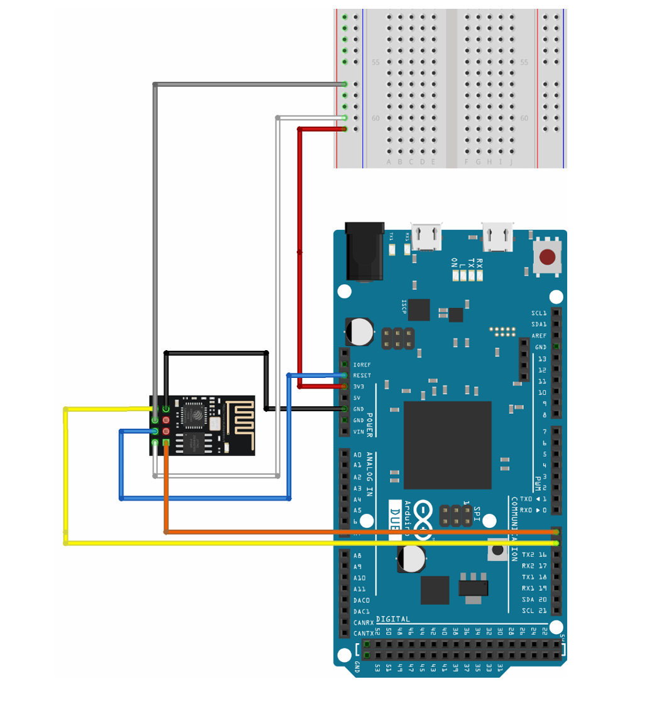

# Smart-Grid-Capstone-Project-2025

A prototype Smart Grid system with an Arduino microcontroller for reading and transferring electrical data, and a a JavaScript based web UI for displaying the data and monitoring data.

### Arduino setup
* Uses an Arduino alongside and ESP-01S WiFi module to recieve wireless commands and transmitt data.
* The ESP module runs a TCP server that is connected to the TX and RX pins on the Arduino where serial data can be sent and recieved.
* Electrical data is collected via external sensors that are also connected to the Arduino in which their readings are converted into digital data for processing
* Arduino runs specific ESP commands starting with 'AT+' for setup and data transfer
  * Example: AT+CIPSTART="TCP","<SERVER_IP>","<PORT>" starts a TCP server with the specified IP address and port number

